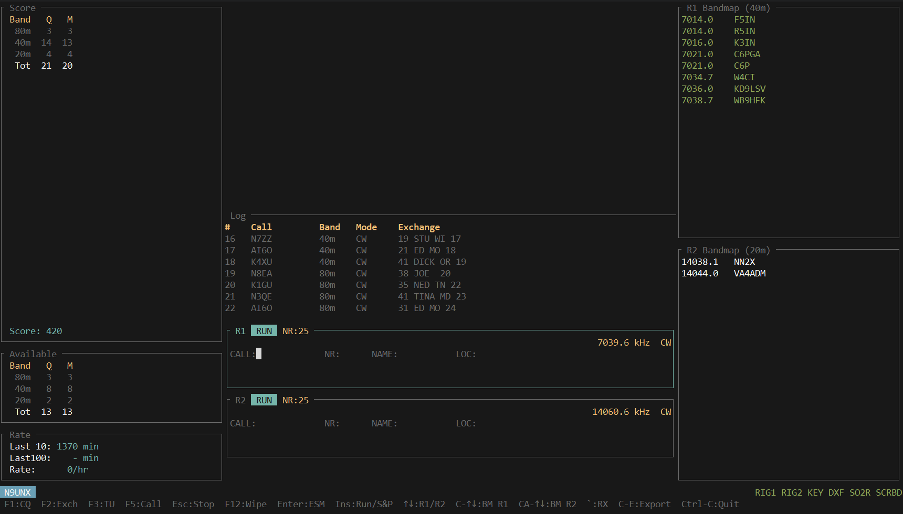

# clogger



A contest logger by Chad Brown, N9UNX.

## About

This is my personal contest logger. I built it for myself, I use it during
contests, and I'm actively developing it as I go. It's not a traditional
open-source ham radio project — I don't have the time to support users,
answer questions, fix bugs that don't affect my own operating, or keep up
with the range of hardware and contests a general-purpose logger would
need to handle.

The code is here, it's free to use, and you are welcome to fork it and
do whatever you want with it — run it as-is, adapt it, rip pieces out,
or use it as a starting point for your own project. If something in here
is useful to you, great. Just please don't expect support, a roadmap, or
promises about anything.

## Running it

The workspace builds with `cargo build` and has three crates:

- `logger-tui` — terminal UI used during contests
- `logger-cli` — headless golden-script runner used for testing
- `logger-core` — pure state-machine library, no IO

To get started, copy `logger-tui.example.toml` to `logger-tui.toml`, fill
in your callsign and hardware, and run:

```bash
cargo run -p logger-tui -- --config logger-tui.toml
```

## Dependencies

clogger depends on a handful of other crates I maintain, all in the same
GitHub account and all pulled as git dependencies. Each one is in the
same "personal project, use at your own risk" status as clogger itself.

| Crate | Repo | What it does |
|---|---|---|
| `qsolog` | [chadsbrown/qsolog](https://github.com/chadsbrown/qsolog) | SQLite-backed QSO log storage with undo/redo |
| `contest-engine` | [chadsbrown/contest-engine](https://github.com/chadsbrown/contest-engine) | Spec-driven contest validation, scoring, and dupe/mult tracking |
| `riglib` | [chadsbrown/riglib](https://github.com/chadsbrown/riglib) | Rig control across Icom (CI-V), Yaesu, Elecraft, Kenwood, and FlexRadio (SmartSDR) |
| `winkey` | [chadsbrown/winkey](https://github.com/chadsbrown/winkey) | WinKeyer CW keyer protocol |
| `otrsp` | [chadsbrown/otrsp](https://github.com/chadsbrown/otrsp) | OTRSP SO2R switch protocol (YCCC SO2R+, microHAM MK2R+, etc.) |
| `dxfeed` | [chadsbrown/dxfeed](https://github.com/chadsbrown/dxfeed) | DX cluster feed client |
| `station-data` | [chadsbrown/station-data](https://github.com/chadsbrown/station-data) | Callsign resolution and station metadata |
| `adif_parser` | [chadsbrown/adif_parser](https://github.com/chadsbrown/adif_parser) | ADIF log file parser |

## License

Licensed under the [MIT License](LICENSE).
