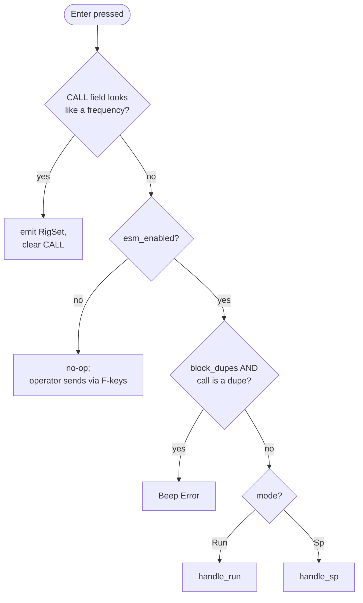
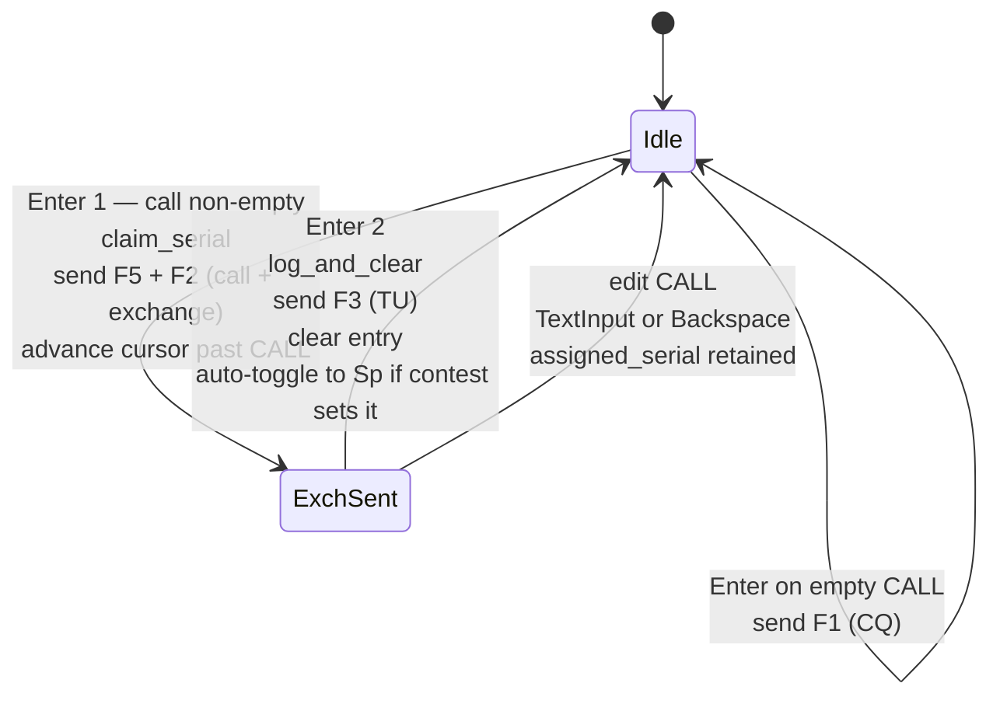
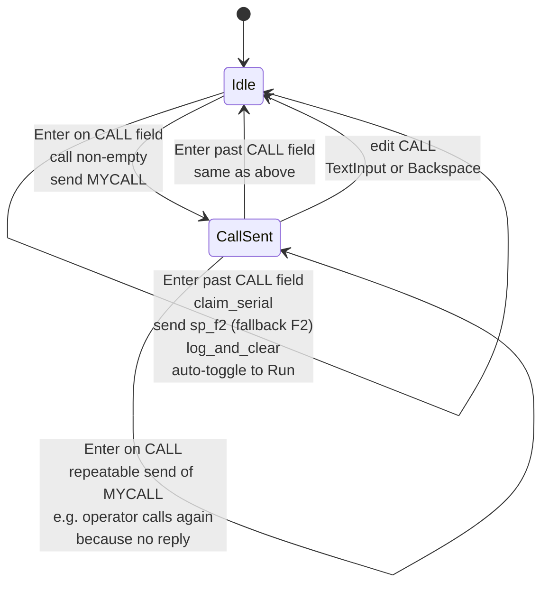
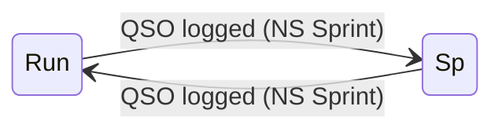

# ESM (Enter Sends Message) — Design & State Machine

ESM is clogger's Enter-key state machine. It compresses the contest-QSO
workflow into a minimal number of keypresses by making Enter context-
sensitive: what it sends, logs, or advances depends on the operator's op
mode, the field the cursor is in, and whether an exchange is already
mid-flight.

This document is the authoritative reference for ESM semantics. For the
user-facing workflow summary, see [operating.md](operating.md). For serial-
number reservation, which is tightly coupled to ESM transitions, see
[serial-numbers.md](serial-numbers.md).

## Core state

ESM state lives on the per-radio `EntryState` (in
`logger-core/src/entry/state.rs`):

| Field | Type | Semantics |
|---|---|---|
| `mode` | `OpMode` | `Run` or `Sp`. Auto-toggled on log for contests where `auto_toggle_mode == true` (currently only NS Sprint). |
| `esm_step` | `EsmStep` | `Idle`, `CallSent`, or `ExchSent`. Tracks where in the Run two-keypress flow (or the S&P `CallSent` repeat state) the operator is. |
| `esm_enabled` | `bool` | If `false`, Enter becomes log-only — no CW emitted by Enter. Set via `esm_enabled` in `config.toml`. |
| `block_dupes` | `bool` | If `true`, Enter beeps and refuses when the call is a known dupe. F-keys are unaffected so the operator can still confirm the dupe over the air. |

## Enter-key decision flow

Source: `logger-core/src/reducer.rs::reduce` — the `Key::Enter` match arm,
which calls `try_frequency_entry` first and falls through to `handle_esm`.

## Run mode (two-step)

Run mode represents "you are calling CQ and someone answered you." You send
their call + your exchange (Enter #1), wait for their exchange, then log
and send TU (Enter #2).

### Enter #1 contract

- Condition: `esm_step == Idle` AND `current_call()` is non-empty.
- Effects, in order:
  1. `esm_step <- ExchSent`
  2. `claim_serial` (reserve this QSO's serial — idempotent if already reserved)
  3. `CwSend(compose_call_exchange)` — the concatenation of `F5` and `F2`, each expanded against the current state
  4. If focus was on the CALL field and the form has a next field: advance focus and emit `UiSetFocus` so the operator can immediately type the received exchange.

### Enter #2 contract

- Condition: `esm_step == ExchSent` AND entry is not invalid.
- Runs `log_and_clear(send_tu=true, send_exch=false)`:
  1. `claim_serial` (safety net — usually a no-op since Enter #1 already claimed)
  2. Build QSO drafts from `contest.build_qso_drafts`
  3. Append `("serial", N)` to each draft's exchange_pairs
  4. Snapshot `last_logged_context` (for the repeat-previous-serial feature)
  5. `clear_values` — clears fields, `assigned_serial`, and `esm_step`
  6. Emit `CwSend(F3)` (TU), `LogInsert` per draft, `UiClearEntry`, `UiSetFocus(field 1)`
  7. If `contest.auto_toggle_mode()`, flip `mode`

Invalid entry on Enter #2 beeps and focuses the first invalid field instead
of logging. Since `assigned_serial` is retained, the next Enter #2 (after
the operator fixes the invalid field) reuses the same serial.

### CALL edits after Enter #1

Editing the CALL field while `esm_step == ExchSent` resets `esm_step` back
to `Idle`. The next Enter fires Enter #1 again — which re-sends the
exchange with the (same) already-claimed serial. `assigned_serial` is
intentionally retained across the edit so the counter doesn't advance.

This is how the operator recovers from a busted call: backspace the CALL
field, retype the correct call, Enter (resends), Enter (logs).

Source: `logger-core/src/entry/esm.rs::handle_run`,
`compose_call_exchange`, `log_and_clear`; `reducer.rs` `touched_call`
branches in `AppEvent::TextInput` and `Key::Backspace`.

## S&P mode (one-step atomic, with a repeat-MYCALL path)

S&P mode represents "you are hunting and calling a CQer."

### Enter on CALL field

- Condition: `focused_field_id() == Some(1)` AND `current_call()` non-empty.
- Effects: `esm_step <- CallSent`, `CwSend({MYCALL})`.
- Does **not** claim the serial. S&P treats the CALL field as a speculative
  staging area until the operator commits by leaving the field.

### Enter past CALL

- Condition: `focused_field_id() != Some(1)` AND entry is valid.
- Effects:
  1. `claim_serial` (reserves if not already reserved by Tab/Space leaving CALL)
  2. `CwSend(sp_f2)` — S&P's "my exchange" macro. Falls back to `F2` if `sp_f2` isn't set in the contest's macro table.
  3. `log_and_clear(send_tu=false, send_exch=false)` — commits the QSO.

Claim + send + log are atomic on this one Enter. This is why S&P never
has an "exchange sent, awaiting log" state analogous to Run's `ExchSent`.

Source: `logger-core/src/entry/esm.rs::handle_sp`.

## State reset semantics

`EntryState::clear_values()` (`logger-core/src/entry/state.rs`) is the
single place that returns an entry to a fresh slate. It resets:

- All field values and cursors
- `focus` to 0
- Validation flags (`overall`, `is_dupe`, `is_new_mult`, `is_passband_qrm`)
- SCP match lists and cycle index
- `assigned_serial` to `None`
- `esm_step` to `Idle`

Callers:

| Caller | Additional work around `clear_values` |
|---|---|
| `log_and_clear` (post-commit) | Re-applies default RST; stores `last_logged_context`; optionally auto-toggles `mode` |
| `Key::F12` Wipe handler | Rolls back `serial_counter` when safe (see [serial-numbers.md](serial-numbers.md)); re-applies default RST |

## CALL-edit `esm_step` reset

Any edit to the CALL field — `AppEvent::TextInput` or `Key::Backspace` in
the `touched_call` branch of `reducer.rs` — unconditionally resets
`esm_step` to `Idle`. This covers both:

- Post-Enter-#1 edits in Run (was `ExchSent`)
- Post-Enter-in-CALL edits in S&P (was `CallSent`)

`assigned_serial` is intentionally **not** cleared by this reset. The
already-reserved serial is reused on the next Enter (see
[serial-numbers.md — Run + F12 timing](serial-numbers.md#timing-diagram-run-keystroke-through-log)).

## QuickLog (Alt+Enter)

`AppEvent::QuickLog` maps to `esm::quick_log`, which runs
`log_and_clear(send_tu=false, send_exch=false)`:

- Claims the serial if not already claimed.
- Logs the QSO.
- Emits `LogInsert` but no `CwSend`.
- Still clears entry, auto-toggles, etc.

Useful for "I already sent the exchange by paddle or F-key and just want
to commit the QSO without more CW."

## F-keys bypass ESM

F1–F9 and Ctrl-Alt-F1..F12 do **not** participate in the `esm_step` state
machine. They:

- Never read `esm_step`.
- Never write `esm_step`.
- Send the expanded macro through `expand_for_send`, which reserves a
  serial when the macro contains `{SERIAL}` and CALL is non-empty.

F-keys and ESM are safely intermixed:

- F2 after Run Enter #1 resends the exchange — the existing `assigned_serial`
  is reused, no new claim fires.
- F2 before any Enter in a new QSO still reserves a serial so the sent
  exchange contains a real serial, not an empty placeholder.
- F-key macros that don't contain `{SERIAL}` (e.g. `F1 = "CQ TEST {MYCALL}"`)
  never touch the counter.

See [serial-numbers.md — F-key parity](serial-numbers.md#f-key-parity) for
the full story.

## Auto-toggle mode

Contests with `auto_toggle_mode == true` (currently only NS Sprint) flip
`mode` between `Run` and `Sp` after every successful log. This models NS
Sprint's rule that whoever just worked a station must QSY.

Other contests leave `mode` unchanged on log. Operators toggle manually
via the `Insert` key (`AppEvent::ToggleOpMode`), or the GUI/TUI may set
it explicitly (`AppEvent::SetOpMode`) — for example, bandmap-select
forces `mode = Sp` to match the workflow of pouncing on a spot.

## Invalid-entry handling

Both `handle_run` (Enter #2) and `handle_sp` (past-CALL Enter) guard the
commit path with `st.focused_entry().overall.is_invalid()`. If invalid:

- A `Beep(Error)` effect fires.
- Focus moves to the first invalid field (`UiSetFocus`).
- No `claim_serial` is called on this invalid path (Run already claimed
  at Enter #1; S&P hasn't claimed yet and won't until the validation passes
  and the operator re-presses Enter).

Run Enter #1 does **not** check validity — it only needs a non-empty CALL
to send the exchange. Validity is checked at log time (Enter #2).

## Edge cases and gotchas

- **`Space` skips the auto-populated RST field.** The RST field is
  populated with the contest default (`"599"` / `"59"`) at entry creation
  and re-applied after `clear_values`. `Space` advances focus, but if
  the next field is RST, it advances once more. `Tab` lands on RST so
  the operator can edit it.
- **Cursor-leave from CALL via `Tab` or `Space`** triggers a serial
  reservation (see [serial-numbers.md](serial-numbers.md#where-claim_serial-fires)).
  This is mostly relevant to S&P but fires harmlessly in Run too.
- **Bandmap select (`Ctrl-Up`/`Down`)** sets `mode = Sp`, populates
  CALL, and resets focus to 0 — but does **not** call `clear_values`.
  Any in-flight `assigned_serial` is preserved; so is stale `esm_step`
  if the operator was mid-QSO. The next Enter or Tab drives the S&P
  flow from there.
- **`esm_enabled = false`** makes Enter a no-op from the ESM path.
  Operators must use F-keys for CW (F1 = CQ, F2 = exchange, F3 = TU,
  F5 = their call, etc.) and QuickLog (Alt+Enter) to log.

## Related files

| File | Role |
|---|---|
| `logger-core/src/entry/state.rs` | `EntryState`, `EsmStep`, `OpMode`, `clear_values` |
| `logger-core/src/entry/esm.rs` | `handle_esm`, `handle_run`, `handle_sp`, `log_and_clear`, `quick_log`, `claim_serial`, `expand_for_send`, `focused_field_id` |
| `logger-core/src/reducer.rs` | `Key::Enter` match arm, `touched_call` reset logic, F-key wiring to `expand_for_send` |
| `logger-core/src/macro_expand.rs` | Token substitution (`{CALL}`, `{SERIAL}`, `{MY<KEY>}`, received-field labels, speed markers) |
| `logger-tui/src/adapters/terminal.rs` | TUI keymap: `Alt+Enter` → `QuickLog`, plain `Enter` → ESM |
| `logger-gui/src/keys.rs` | GUI keymap (parallel to TUI) |
| `scripts/ns_sprint_*.json`, `scripts/*_sp_*.json`, `scripts/*_run_*.json` | Golden-script regression coverage |
