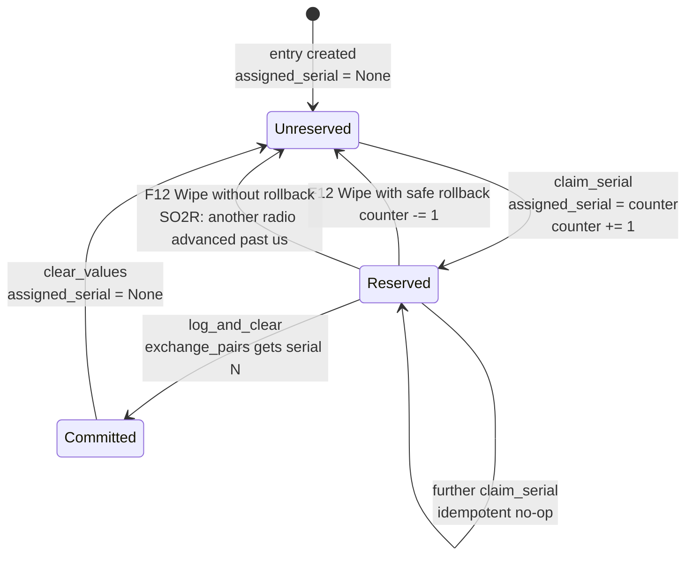
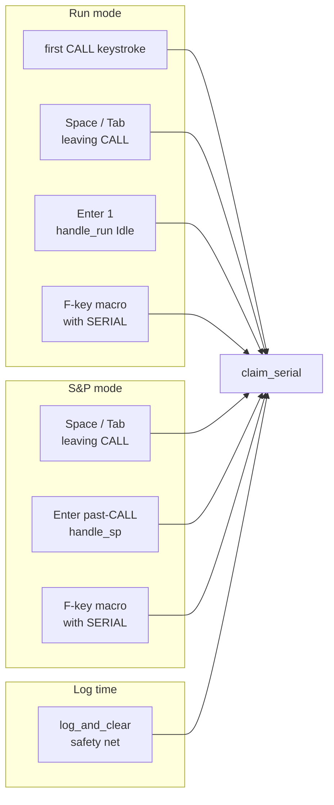
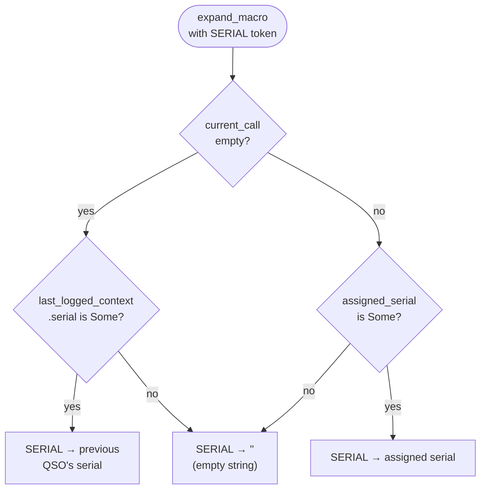
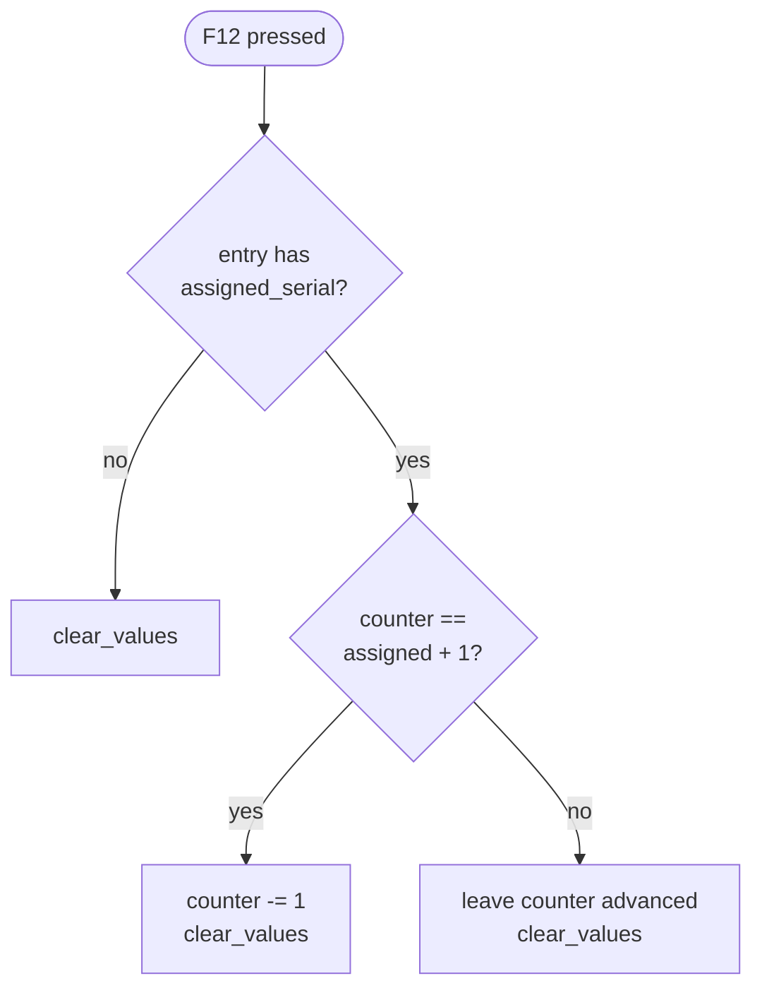
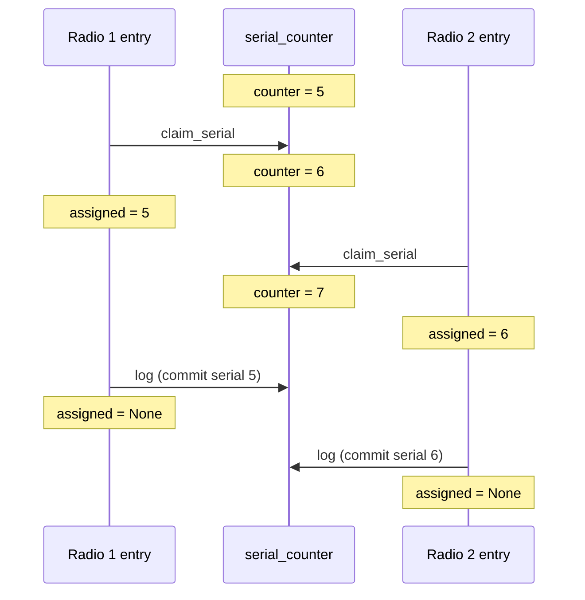

# Serial Numbers — Lifecycle & Semantics

For contests that use sequential serial numbers (CQ WPX, NS Sprint, ARRL
Sweepstakes, MST, NA Sprint), clogger reserves and commits serials with
the goal of matching N1MM+'s operator-visible semantics: the visible
counter always reflects "what you'll send next," and abandoning a QSO via
Wipe returns the serial to the pool so the next QSO doesn't skip numbers.

See [esm.md](esm.md) for the Enter-key state machine that drives most
reservation sites. For general CW macros and the `{SERIAL}` token, see
[operating.md](operating.md#cw-macros).

## State

Two pieces of state cooperate:

| State | Location | Type | Semantics |
|---|---|---|---|
| `serial_counter` | `AppState` (global) | `Option<u32>` | The next serial to hand out. `None` for contests that don't use serials. |
| `assigned_serial` | `EntryState` (per-radio) | `Option<u32>` | The serial reserved by the active QSO on this radio. `None` until first reservation; cleared by `clear_values` after a successful log. |
| `last_logged_context.serial` | `EntryState` (per-radio) | `Option<u32>` | The serial of the most recently logged QSO on this radio. Used to resolve `{SERIAL}` when the CALL field is empty (repeat-previous-serial feature). |

Invariants:
- `serial_counter > max(assigned_serial across all entries)` whenever any
  entry has a claim (the counter is always one ahead of the highest
  in-flight claim).
- A serial is written to `exchange_pairs` as `("serial", N.to_string())`
  only at log time, from `assigned_serial`.
- `serial_counter` is not persisted directly. On boot,
  `logger-runtime/src/bootstrap.rs` re-derives it from
  `log_adapter::max_sent_serial() + 1` (or accepts an explicit
  `start_serial` override from config).

## Lifecycle



Legend:

- **Unreserved → Reserved.** Fires at one of the reservation sites listed
  below. `claim_serial` is idempotent: a second call on the same QSO is a
  no-op.
- **Reserved → Committed.** The `log_and_clear` path. Serial is written
  into the QSO draft's `exchange_pairs` before `clear_values` wipes
  `assigned_serial`.
- **Reserved → Unreserved (with rollback).** F12 Wipe when the wiped
  entry holds the topmost claim. Counter decrements by one. See
  [F12 rollback](#f12-rollback-semantics) for the safety condition.
- **Reserved → Unreserved (without rollback).** F12 Wipe when another
  radio has a claim past ours. The counter stays advanced; a gap is
  left in our log. Correct because the other radio's claim is committed
  and cannot be reassigned.

## Where `claim_serial` fires

The reservation is triggered at several sites — all routed through
`claim_serial` in `logger-core/src/entry/esm.rs`. The redundancy is
deliberate: it ensures that by the time the CW keyer sees a
`{SERIAL}`-bearing template, a serial is already reserved.



### Run mode reservation sites

1. **First keystroke into CALL.** In `reducer.rs`, the
   `AppEvent::TextInput` and `Key::Backspace` handlers — their
   `touched_call` branches — call `claim_serial` when
   `mode == Run && !current_call().is_empty()`. This matches N1MM+:
   the serial is visible to the operator as soon as they start typing.
2. **Space / Tab leaving CALL.** `Key::Tab` and `Key::Space` handlers
   claim when focus was on CALL, is no longer on CALL, and CALL is
   non-empty. Idempotent in Run (already claimed at keystroke).
3. **Enter #1 in Run.** `esm.rs::handle_run` Idle branch. Safety net.
4. **F-key macro send.** `esm.rs::expand_for_send` (routed from F1, F2,
   F3, F5, F7, F8, F9, Ctrl-Alt-F1..F12). Fires when the template
   contains `{SERIAL}` and CALL is non-empty.

### S&P mode reservation sites

1. **Space / Tab leaving CALL.** Same handler as Run; this is S&P's
   primary reservation site since speculative CALL typing shouldn't
   burn a serial.
2. **Enter past-CALL.** `esm.rs::handle_sp` past-CALL branch.
3. **F-key macro send.** Same helper as Run.

### Fallback

`log_and_clear` also calls `claim_serial` before building the QSO draft.
This guarantees that even if some future code path emits a `LogInsert`
without going through any of the above sites, the QSO record still gets
a serial.

## Reservation non-sites

Deliberately **not** triggering `claim_serial`:

- **Any keystroke in S&P mode.** Speculative typing is free; serial is
  committed only when the operator commits (Tab, Space, Enter, F-key
  send).
- **CALL field backspaces that bring the field to empty.** The early-
  reserve guard includes `!current_call().is_empty()`, so backspacing
  out a call in Run mode does not re-claim a new serial after the old
  one is released via F12.
- **F4.** Hard-coded to `{MYCALL}`; cannot contain `{SERIAL}`.
- **Mode toggles, radio focus changes, bandmap selects.** None clear or
  reserve serials directly; whatever `assigned_serial` was in flight on
  the affected radio stays in flight.

## Idempotency

`claim_serial` (`logger-core/src/entry/esm.rs`) has three guards:

```rust
fn claim_serial(st: &mut AppState, contest: &dyn ContestEntry) {
    if !contest.uses_serial() { return; }                // contest opt-out
    if st.focused_entry().assigned_serial.is_some() { return; }  // already reserved
    if let Some(counter) = st.serial_counter {
        st.focused_entry_mut().assigned_serial = Some(counter);
        st.serial_counter = Some(counter + 1);
    }
}
```

This is why `expand_for_send` can call it on every F-key press, and why
the reducer can call it on every keystroke and cursor-leave — at most
one counter advance per QSO.

## Timing diagram: Run keystroke through log

```
event                counter   assigned   esm_step   cw emitted
─────────────────────────────────────────────────────────────────
(start)              1         None       Idle       —
Text "N"             2         Some(1)    Idle       —         (keystroke reserve)
Text "6TR"           2         Some(1)    Idle       —         (idempotent, no claim)
Space                2         Some(1)    Idle       —         (cursor-leave reserve; no-op)
Text "5" (NR)        2         Some(1)    Idle       —
Space                2         Some(1)    Idle       —
Text "JIM" (NAME)    2         Some(1)    Idle       —
Space                2         Some(1)    Idle       —
Text "CA" (LOC)      2         Some(1)    Idle       —
Enter (#1)           2         Some(1)    ExchSent   "K1ABC N0CALL 1 JIM IN"
Enter (#2)           2         None       Idle       "R"  + QSO logged w/ serial 1
```

Counter advances exactly once across six potential claim sites.

## Timing diagram: Run + F12 + retry (with rollback)

```
event                counter   assigned   esm_step   notes
─────────────────────────────────────────────────────────────────
(start)              1         None       Idle
Text "N6TR"          2         Some(1)    Idle       keystroke reserve
F12 Wipe             1         None       Idle       counter == 1+1 = 2; rollback
Text "W9ABC"         2         Some(1)    Idle       reserves 1 again
... Enter x2         2         None       Idle       QSO logged with serial 1
```

Counter net advance across the wipe + retype: **one**, not two. This is
the path that closed the 28→32 gap in the user's session.

## `{SERIAL}` macro expansion

In `logger-core/src/macro_expand.rs`, the `{SERIAL}` token resolves
differently depending on CALL field state. This matches N1MM+'s `#`
macro behavior.



After the F-key parity fix, the `"assigned_serial is None"` branch
shouldn't fire in practice for F-key macro sends, since `expand_for_send`
calls `claim_serial` first when CALL is non-empty. The only way to get a
blank `{SERIAL}` now is the genuine "empty CALL, no previous QSO" case
at the very start of a session — which is reasonable.

### Use case: F-key repeat after log

When the operator logs a QSO, `clear_values` sets `assigned_serial = None`
and `last_logged_context.serial = Some(N)`. CALL is empty. If the
operator then presses F2 (or any `{SERIAL}`-bearing macro) without typing
a new call, `expand_for_send`:

1. Sees `{SERIAL}` in the template.
2. Sees `current_call()` is empty → skips `claim_serial` (no counter
   advance).
3. Delegates to `expand_macro`, which resolves `{SERIAL}` from
   `last_logged_context.serial` → `"N"`.

Net effect: the just-sent exchange repeats with the just-used serial. No
new reservation.

Covered by the `scripts/mst_f2_repeat_after_log.json` golden.

## F-key parity

Every user-customizable F-key macro is routed through `expand_for_send`
in `reducer.rs`. The complete list: `F1`, `F2`, `F3`, `F5`, `F7`, `F8`,
`F9`, `CtrlAltF1..F12`.

F4 is excluded — its template is hard-coded to `"{MYCALL}"` and cannot
contain `{SERIAL}`, so routing it through `expand_for_send` would add
overhead without effect.

This guarantees: **a `{SERIAL}` token in any F-key macro sends a real
serial, never an empty placeholder** — as long as CALL is non-empty.
Covered by `scripts/ns_sprint_ctrl_alt_macro_claims_serial.json` and
`scripts/ns_sprint_f2_before_enter_claims_serial.json`.

## F12 rollback semantics

F12 Wipe (`Key::F12` in `reducer.rs`) rolls back `serial_counter` when
the wiped entry's claim is the topmost.



The safety check matters in SO2R. If Radio 1 holds serial N and Radio 2
has already advanced the counter to claim N+1, rolling back Radio 1's
claim would hand serial N to the next QSO — a duplicate of what Radio 1
already put on air, and a collision with whatever Radio 2's QSO commits.
The check avoids this by only rolling back when no other radio has
advanced past the wiped claim.

Covered by `scripts/ns_sprint_f12_rolls_back_serial.json`. The SO2R
non-rollback scenario is covered implicitly by
`scripts/so2r_serial_shared_counter.json`.

## SO2R semantics

`serial_counter` is global on `AppState`. `assigned_serial` is per-radio
(on `EntryState`, one per entry in `AppState.entries`). Both radios
draw from the same counter.



Rollback safety example — Radio 1 wipes instead of logging:

- Counter is 7 (both claims active, Radio 1 holds 5, Radio 2 holds 6).
- Radio 1 F12: `7 != 5+1` (it's `5+2`). No rollback.
- Radio 2 logs with serial 6. Counter stays 7. Next QSO gets 7.
- Serial 5 is skipped in the final log — correct, because it was sent
  on air for the abandoned QSO.

## Persistence

`serial_counter` is not written to disk. On each boot:

```rust
// logger-runtime/src/bootstrap.rs
if contest.uses_serial() {
    let start = config
        .start_serial
        .unwrap_or_else(|| log_adapter.max_sent_serial() + 1);
    state.serial_counter = Some(start);
}
```

Where `log_adapter::max_sent_serial()` scans all non-voided logged QSOs
for the maximum `serial` exchange_pair.

Consequences:

- **Mid-session crash or force-quit.** Any claimed-but-unlogged serials
  are re-derived away. The counter starts fresh from `max_logged + 1`,
  which may be less than the in-memory counter was at crash time.
  Effectively, a crash returns all in-flight claims to the pool.
- **`start_serial` config override.** Wins over the derived value.
  Useful when splitting a single contest's log across multiple session
  files, or resuming from an existing paper log.

## Waste paths (summary)

A "waste" is an advance of `serial_counter` without a corresponding
logged QSO. Post-fix:

| Path | Outcome |
|---|---|
| F12 Wipe with topmost claim | Rolled back — **no waste** |
| F12 Wipe with non-topmost claim (SO2R) | Intentional gap; other radio's claim is committed — **not a bug** |
| Backspace / TextInput over CALL | `assigned_serial` retained; next Enter reuses — **no waste** |
| Bandmap select mid-claim | Only CALL overwritten; `assigned_serial` retained — **no waste** |
| Manual mode toggle (Insert) | No state cleared — **no waste** |
| App exit with claim outstanding | Counter re-derived from log on restart — **no waste** |
| DB insert failure | Counter advanced, QSO not in log — **potential waste, rare** |

## Networked mode considerations (future)

The current design is safe for single-logger SO2R because `claim_serial`
is a synchronous read-modify-write inside the single-threaded reducer,
and the F12 rollback's `counter == assigned + 1` check is SO2R-aware.

Before clogger grows a networked / multi-station mode, the following
design decisions must be made:

- **Counter ownership.** `AppState.serial_counter` is a local `Option<u32>`.
  For per-station counters with a shared log, that's fine as long as
  `max_sent_serial` (`logger-runtime/src/log_adapter.rs`) is filtered by
  station. For a shared serial pool, a coordinator is required — local
  reducer atomicity does not extend across the network.
- **Station identity.** `operator_id` is a field on log records but is
  hardcoded to `0` today (see `log_adapter.rs`, `rtc_adapter.rs`,
  `rtc_xml.rs`). Any networked mode needs a distinct identity per station
  plumbed through the reducer and persistence.
- **F12 rollback across peers.** Today rollback is local-only. In a
  shared-pool design, a local rollback without peer notification risks
  duplicate issuance of a serial that another station has already
  committed against.
- **Boot-time counter derivation.** `max_sent_serial + 1` assumes the
  local log contains every committed serial. In a shared-log design
  where peers may have committed serials not yet synced locally, this
  underestimates the counter.
- **Network partition.** Local and peer claims proceed independently
  during a partition; no reconcile logic exists. Whichever flavor of
  networked mode is built will need an explicit policy here.

These are tracked for when the work is scheduled; no code changes have
been made to support networked operation.

## N1MM+ parity reference

clogger's serial semantics are designed to match N1MM+'s published
behavior so operators with muscle memory from other loggers don't get
surprised. From the N1MM+ documentation at
[n1mmwp.hamdocs.com — Function Keys, Messages and Macros](https://n1mmwp.hamdocs.com/setup/function-keys/)
and community Q&A:

| N1MM+ behavior | clogger equivalent |
|---|---|
| `#` macro: current serial if call non-empty; previous serial if empty | `{SERIAL}` — see [macro expansion](#serial-macro-expansion) |
| Run mode: serial reserved at first CALL keystroke | `TextInput` / `Backspace` touched_call branch, `mode == Run` guard |
| S&P mode: serial reserved when cursor leaves CALL, or F2/Enter sends exchange | `Key::Tab` / `Key::Space` cursor-leave; `handle_sp` past-CALL; `expand_for_send` |
| Alt+W (Wipe): un-reserves the serial | `Key::F12` Wipe with rollback |

## Related files

| File | Role |
|---|---|
| `logger-core/src/state.rs` | `AppState.serial_counter`, `LastLoggedContext.serial` |
| `logger-core/src/entry/state.rs` | `EntryState.assigned_serial`, `clear_values` |
| `logger-core/src/entry/esm.rs` | `claim_serial`, `expand_for_send`, `log_and_clear`, `focused_field_id` |
| `logger-core/src/macro_expand.rs` | `{SERIAL}` token substitution |
| `logger-core/src/reducer.rs` | Reservation sites (TextInput, Backspace, Tab, Space); F12 rollback handler |
| `logger-runtime/src/bootstrap.rs` | `serial_counter` initialization from log |
| `logger-runtime/src/log_adapter.rs` | `max_sent_serial` |
| `scripts/ns_sprint_*.json`, `scripts/so2r_serial_*.json` | Golden-script regression coverage |
